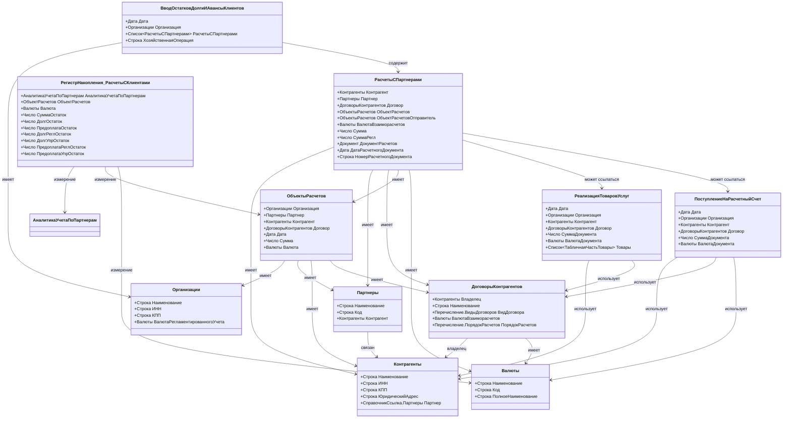
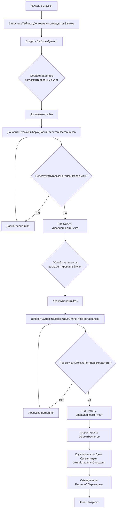
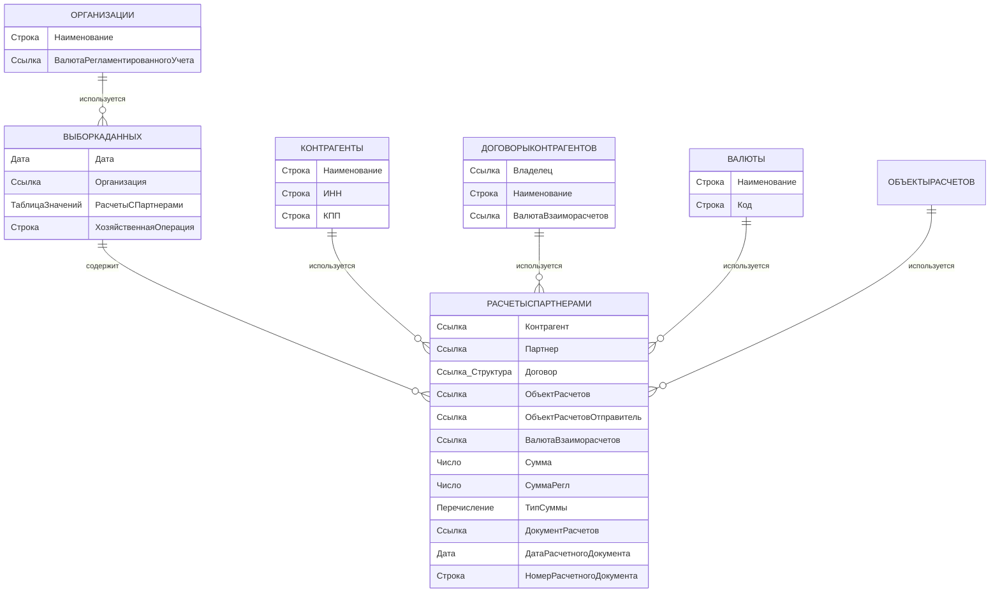

# PRD: Анализ алгоритма выгрузки ВводОстатковДолгиИАвансыКлиентов

## 1. Общая информация

**Объект метаданных**: ВводОстатковДолгиИАвансыКлиентов  
**Тип объекта**: Документ  
**Назначение**: Выгрузка остатков по долгам и авансам клиентов для переноса данных между информационными базами 1С

**Версия платформы**: 8.3.26  
**Источник**: УправлениеПроизводственнымПредприятием (УПП) 1.3.243.1  
**Приемник**: 1С:ERP Управление предприятием 2 (2.5.24.68)

---

## 2. Используемые счета для сбора остатков

### 2.1 Основные счета бухгалтерского учета

Для сбора остатков по долгам и авансам клиентов используются следующие счета:

#### **Счет 62 "Расчеты с покупателями и заказчиками"**
- **62.01** - Расчеты в рублях (дебиторская задолженность)
- **62.02** - Расчеты по авансам полученным
- **62.21** - Расчеты в валюте (дебиторская задолженность)
- **62.22** - Расчеты по авансам полученным в валюте

**Аналитика по счету 62:**
- **Субконто1**: Контрагент (Справочник.Контрагенты)
- **Субконто2**: Договор (Справочник.ДоговорыКонтрагентов)
- **Валюта**: Валюта взаиморасчетов (Справочник.Валюты)

#### **Счет 76 "Расчеты с разными дебиторами и кредиторами"**
Может использоваться для учета расчетов с прочими дебиторами и кредиторами, которые не относятся к основным покупателям.

**Аналитика по счету 76:**
- Аналогично счету 62: Контрагент, Договор, Валюта

### 2.2 Регистры накопления для получения остатков

Алгоритм использует следующие регистры накопления:

1. **РегистрНакопления.РасчетыСКлиентами**
   - Используется для получения остатков по расчетам с клиентами
   - Измерения: АналитикаУчетаПоПартнерам, ОбъектРасчетов, Валюта
   - Ресурсы: СуммаОстаток, ДолгОстаток, ПредоплатаОстаток

2. **РегистрНакопления.РасчетыСКлиентамиПоДокументам**
   - Детализация расчетов по документам
   - Измерения: АналитикаУчетаПоПартнерам, ОбъектРасчетов, Валюта
   - Ресурсы: ДолгРеглОстаток, ДолгУпрОстаток, ПредоплатаРеглОстаток, ПредоплатаУпрОстаток

3. **РегистрНакопления.РасчетыСКлиентамиПоСрокам**
   - Расчеты с детализацией по срокам погашения
   - Используется для определения даты планового погашения

### 2.3 Логика определения долгов и авансов

- **Долги клиентов**: Остатки с положительным сальдо (Дт 62.01, 62.21)
- **Авансы клиентов**: Остатки с отрицательным сальдо (Кт 62.02, 62.22)

---

## 3. Используемые документы и справочники

### 3.1 Справочники

#### **Контрагенты**
- **Назначение**: Информация о юридических и физических лицах, с которыми организация ведет расчеты
- **Ключевые поля**:
  - Наименование
  - ИНН
  - КПП
  - Юридический адрес
  - Партнер (связь со справочником Партнеры)

#### **ДоговорыКонтрагентов**
- **Назначение**: Детализация условий взаимоотношений с контрагентами
- **Ключевые поля**:
  - Владелец (Контрагент)
  - Наименование
  - Вид договора
  - Валюта взаиморасчетов
  - Порядок расчетов (Перечисление.ПорядокРасчетов)

#### **Валюты**
- **Назначение**: Справочник валют для указания валюты расчетов
- **Ключевые поля**:
  - Наименование
  - Код
  - Полное наименование

#### **Организации**
- **Назначение**: Информация о собственной организации
- **Ключевые поля**:
  - Наименование
  - ИНН
  - КПП
  - Валюта регламентированного учета

#### **Партнеры**
- **Назначение**: Расширенная аналитика по партнерам
- **Связь**: Связан со справочником Контрагенты

#### **ОбъектыРасчетов**
- **Назначение**: Справочник объектов расчетов для детализации взаиморасчетов
- **Использование**: Может содержать ссылки на документы или договоры

### 3.2 Документы (для определения остатков и их аналитики)

#### **РеализацияТоваровУслуг**
- **Назначение**: Документ отгрузки товаров или оказания услуг
- **Формирует**: Дебиторскую задолженность (Дт 62.01)
- **Использование в алгоритме**: Определение документа-основания для возникновения задолженности

#### **ПоступлениеНаРасчетныйСчет / ПоступлениеДенежныхСредств**
- **Назначение**: Документы, отражающие получение оплаты от клиентов
- **Формирует**: Авансы или погашение задолженности (Кт 62.02)
- **Использование в алгоритме**: Определение документа-основания для авансов

#### **СписаниеСРасчетногоСчета / ВыдачаДенежныхСредств**
- **Назначение**: Могут использоваться для возврата авансов клиентам
- **Использование в алгоритме**: Корректировка остатков

#### **КорректировкаДолга**
- **Назначение**: Документ для ручной корректировки взаиморасчетов
- **Использование в алгоритме**: Корректировка остатков

#### **ВводНачальныхОстатков / ВводОстатковВзаиморасчетов**
- **Назначение**: Документы для первоначального ввода остатков по взаиморасчетам
- **Использование в алгоритме**: Источник данных при первичной загрузке

---

## 4. Поля результирующей таблицы значения ВыборкаДанных

### 4.1 Структура основной таблицы ВыборкаДанных

Таблица значений `ВыборкаДанных` содержит следующие колонки:

| Поле | Тип | Описание |
|------|-----|----------|
| **Дата** | Дата | Дата остатков (обычно КонецДня(ДатаОстатков)) |
| **Организация** | Ссылка | Ссылка на элемент справочника "Организации" |
| **РасчетыСПартнерами** | ТаблицаЗначений | Вложенная таблица с детализацией расчетов по контрагентам |
| **ХозяйственнаяОперация** | Строка | Вид хозяйственной операции:<br>- "ВводОстатковЗадолженностиКлиентов" (для долгов)<br>- "ВводОстатковАвансовКлиентов" (для авансов) |

### 4.2 Структура табличной части РасчетыСПартнерами

Таблица значений `РасчетыСПартнерами` содержит следующие колонки:

| Поле | Тип | Описание |
|------|-----|----------|
| **Контрагент** | Ссылка | Ссылка на элемент справочника "Контрагенты" |
| **Партнер** | Ссылка | Ссылка на элемент справочника "Партнеры" (может быть пустым) |
| **Договор** | Ссылка/Структура | Ссылка на элемент справочника "ДоговорыКонтрагентов" или структура с параметрами договора |
| **ОбъектРасчетов** | Ссылка | Ссылка на объект расчетов (документ или договор) |
| **ОбъектРасчетовОтправитель** | Ссылка | Ссылка на объект расчетов в системе-отправителе (для обмена) |
| **ВалютаВзаиморасчетов** | Ссылка | Ссылка на элемент справочника "Валюты" |
| **Сумма** | Число | Сумма долга/аванса в валюте взаиморасчетов (для управленческого учета) |
| **СуммаРегл** | Число | Сумма долга/аванса в валюте регламентированного учета |
| **ТипСуммы** | Перечисление | Тип суммы (Долг/Аванс) |
| **ДокументРасчетов** | Ссылка | Ссылка на документ, являющийся основанием для возникновения остатка |
| **ДатаРасчетногоДокумента** | Дата | Дата документа-основания |
| **НомерРасчетногоДокумента** | Строка | Номер документа-основания |
| **ХозяйственнаяОперация** | Строка | Вид хозяйственной операции (дублируется из основной таблицы) |

### 4.3 Правила заполнения полей

#### Правила для поля "ХозяйственнаяОперация":
- **"ВводОстатковЗадолженностиКлиентов"** - для остатков с положительным сальдо (долги клиентов)
- **"ВводОстатковАвансовКлиентов"** - для остатков с отрицательным сальдо (авансы клиентов)

#### Правила для поля "ОбъектРасчетов":
1. Если заполнен `ДокументРасчетов`, то `ОбъектРасчетов = ДокументРасчетов`
2. Если `ОбъектРасчетов` является договором и порядок расчетов = "ПоЗаказам", то используется документ расчетов
3. В противном случае используется договор или другой объект расчетов

#### Правила для поля "ВалютаВзаиморасчетов":
- Если не заполнено, устанавливается валюта регламентированного учета организации

---

## 5. Алгоритм выгрузки данных

### 5.1 Общая схема алгоритма

```
1. Инициализация таблиц остатков
   └─> Выполнить(Алгоритмы.ЗаполнитьТаблицыДолговАвансовКредитовЗаймов)
   
2. Создание структуры ВыборкаДанных
   └─> Создать таблицу значений с колонками: Дата, Организация, РасчетыСПартнерами, ХозяйственнаяОперация
   
3. Обработка долгов клиентов (регламентированный учет)
   └─> ТаблицаОстатков = ДолгиКлиентыРез
   └─> Выполнить(Алгоритмы.ДобавитьСтрокиВыборкиДолгиКлиентовПоставщиков)
   
4. Обработка долгов клиентов (управленческий учет) [если не ПерегружатьТолькоРеглВзаиморасчеты]
   └─> ТаблицаОстатков = ДолгиКлиентыУпр
   └─> Выполнить(Алгоритмы.ДобавитьСтрокиВыборкиДолгиКлиентовПоставщиков)
   
5. Обработка авансов клиентов (регламентированный учет)
   └─> ТаблицаОстатков = АвансыКлиентыРез
   └─> Выполнить(Алгоритмы.ДобавитьСтрокиВыборкиДолгиКлиентовПоставщиков)
   
6. Обработка авансов клиентов (управленческий учет) [если не ПерегружатьТолькоРеглВзаиморасчеты]
   └─> ТаблицаОстатков = АвансыКлиентыУпр
   └─> Выполнить(Алгоритмы.ДобавитьСтрокиВыборкиДолгиКлиентовПоставщиков)
   
7. Корректировка ОбъектРасчетов
   └─> Для каждой строки: ОбъектРасчетов = ДокументРасчетов
   
8. Группировка данных
   └─> Группировка по полям: Дата, Организация, ХозяйственнаяОперация
   └─> Объединение таблиц РасчетыСПартнерами
```

### 5.2 Источники данных для таблиц остатков

Алгоритм `ЗаполнитьТаблицыДолговАвансовКредитовЗаймов` формирует следующие таблицы:

#### **ДолгиКлиентыРез** (регламентированный учет)
- Источник: РегистрНакопления.РасчетыСКлиентами.Остатки
- Условие: СуммаОстаток > 0 (или ДолгРеглОстаток > 0)
- Группировка: АналитикаУчетаПоПартнерам, ОбъектРасчетов, Валюта

#### **ДолгиКлиентыУпр** (управленческий учет)
- Источник: РегистрНакопления.РасчетыСКлиентами.Остатки
- Условие: СуммаОстаток > 0 (или ДолгУпрОстаток > 0)
- Группировка: АналитикаУчетаПоПартнерам, ОбъектРасчетов, Валюта

#### **АвансыКлиентыРез** (регламентированный учет)
- Источник: РегистрНакопления.РасчетыСКлиентами.Остатки
- Условие: СуммаОстаток < 0 (или ПредоплатаРеглОстаток > 0)
- Группировка: АналитикаУчетаПоПартнерам, ОбъектРасчетов, Валюта

#### **АвансыКлиентыУпр** (управленческий учет)
- Источник: РегистрНакопления.РасчетыСКлиентами.Остатки
- Условие: СуммаОстаток < 0 (или ПредоплатаУпрОстаток > 0)
- Группировка: АналитикаУчетаПоПартнерам, ОбъектРасчетов, Валюта

### 5.2.1 Структура таблиц остатков

Все таблицы остатков (ДолгиКлиентыРез, ДолгиКлиентыУпр, АвансыКлиентыРез, АвансыКлиентыУпр) имеют одинаковую структуру полей:

| Поле | Тип | Описание | Источник данных |
|------|-----|----------|-----------------|
| **Организация** | Ссылка | Организация, для которой формируются остатки | АналитикаУчетаПоПартнерам.Организация |
| **Контрагент** | Ссылка | Контрагент (клиент) | АналитикаУчетаПоПартнерам.Контрагент |
| **Партнер** | Ссылка | Партнер (может быть пустым) | АналитикаУчетаПоПартнерам.Партнер |
| **Договор** | Ссылка | Договор контрагента (может быть пустым) | АналитикаУчетаПоПартнерам.Договор |
| **ДоговорКонтрагента** | Ссылка | Альтернативное поле для договора (опционально) | АналитикаУчетаПоПартнерам.Договор |
| **ОбъектРасчетов** | Ссылка/Структура | Объект расчетов (документ или договор) | РегистрНакопления.РасчетыСКлиентами.ОбъектРасчетов |
| **Валюта** | Ссылка | Валюта взаиморасчетов | РегистрНакопления.РасчетыСКлиентами.Валюта |
| **Сумма** | Число | Сумма остатка в валюте взаиморасчетов (для управленческого учета) | РегистрНакопления.РасчетыСКлиентами.СуммаОстаток |
| **СуммаОстаток** | Число | Общая сумма остатка | РегистрНакопления.РасчетыСКлиентами.СуммаОстаток |
| **СуммаВзаиморасчетовОстаток** | Число | Сумма в валюте взаиморасчетов | РегистрНакопления.РасчетыСКлиентами.СуммаОстаток |
| **СуммаВзаиморасчетовОстатокРуб** | Число | Сумма взаиморасчетов в рублях | Пересчет из валюты в рубли |
| **СуммаОстатокРуб** | Число | Сумма остатка в рублях | Пересчет из валюты в рубли |
| **ДокументРасчетовСКонтрагентом** | Ссылка/Строка | Документ расчетов (ссылка или строковое представление) | РегистрНакопления.РасчетыСКлиентамиПоДокументам |
| **ДокументРасчетов** | Ссылка/Строка | Альтернативное поле для документа расчетов | РегистрНакопления.РасчетыСКлиентамиПоДокументам |
| **ДатаРасчетногоДокумента** | Дата | Дата документа-основания для остатка | РегистрНакопления.РасчетыСКлиентамиПоДокументам или из ОбъектРасчетов |
| **НомерРасчетногоДокумента** | Строка | Номер документа-основания | РегистрНакопления.РасчетыСКлиентамиПоДокументам или из ОбъектРасчетов |
| **НомерВходящегоДокумента** | Строка | Номер входящего документа | Из документа расчетов |
| **ДатаВходящегоДокумента** | Дата | Дата входящего документа | Из документа расчетов |
| **Сделка** | Ссылка | Сделка (ЗаказПокупателя и т.д.) | Из ОбъектРасчетов или из регистра |
| **ТипСрочности** | Ссылка | Тип срочности задолженности | РегистрНакопления.РасчетыСКлиентамиПоСрокам |
| **ДатаПлатежа** | Дата | Плановая дата погашения | РегистрНакопления.РасчетыСКлиентамиПоСрокам |
| **Курс** | Число | Курс валюты на дату остатков | Из регистра валют |

**Примечания:**
- Поля могут быть не заполнены в зависимости от наличия данных в регистрах
- Для регламентированного учета используются поля с суффиксом "Регл" (ДолгРеглОстаток, ПредоплатаРеглОстаток)
- Для управленческого учета используются поля с суффиксом "Упр" (ДолгУпрОстаток, ПредоплатаУпрОстаток)

### 5.3 Алгоритм ДобавитьСтрокиВыборкиДолгиКлиентовПоставщиков

**Входные параметры:**
- `ТаблицаОстатков` - таблица значений с остатками
- `Параметры.ПараметрыАлгоритмов.ИмяТекущегоМассиваОстатков` - имя массива ("ДолгиКлиентов" или "АвансыКлиентов")

**Логика работы:**
1. Для каждой строки из `ТаблицаОстатков`:
   - Определить хозяйственную операцию на основе `ИмяТекущегоМассиваОстатков`
   - Найти или создать строку в `ВыборкаДанных` с соответствующими: Дата, Организация, ХозяйственнаяОперация
   - Добавить строку в табличную часть `РасчетыСПартнерами` с данными из `ТаблицаОстатков`

2. Заполнение полей строки `РасчетыСПартнерами`:
   - Контрагент ← из АналитикаУчетаПоПартнерам.Контрагент
   - Партнер ← из АналитикаУчетаПоПартнерам.Партнер
   - Договор ← из АналитикаУчетаПоПартнерам.Договор
   - ОбъектРасчетов ← из ОбъектРасчетов
   - ВалютаВзаиморасчетов ← из Валюта
   - Сумма ← из СуммаОстаток (для управленческого учета)
   - СуммаРегл ← из СуммаОстаток (для регламентированного учета)
   - ДокументРасчетов ← определяется из ОбъектРасчетов или из регистра РасчетыСКлиентамиПоДокументам

### 5.4 Структуры, создаваемые при выгрузке

В процессе выгрузки данных создаются специальные структуры для представления объектов, которые не могут быть переданы как ссылки (например, договоры другой организации или документы, отсутствующие в базе-приемнике).

#### 5.4.1 Структура Первичного Документа (СтруктураПД)

**Назначение:** Представляет документ-основание для возникновения остатка, когда документ не может быть передан как ссылка (отсутствует в базе-приемнике или является документом другой организации).

**Когда создается:**
1. Когда поле `ДокументРасчетовСКонтрагентом` не заполнено или содержит строковое представление документа
2. Когда документ существует, но требуется передать его реквизиты в структурированном виде для создания в базе-приемнике

**Структура полей:**

| Поле | Тип | Описание | Правила заполнения |
|------|-----|----------|-------------------|
| **НаименованиеВходящегоДокумента** | Строка | Наименование первичного документа | Из строкового представления документа или "Первичный документ не указан" |
| **Организация** | Ссылка | Организация документа | Из строки остатков |
| **Контрагент** | Ссылка | Контрагент документа | Из строки остатков |
| **Договор** | Ссылка/Структура | Договор контрагента | Ссылка на договор или СтруктураДоговора |
| **Валюта** | Ссылка | Валюта документа | Из строки остатков (ВалютаВзаиморасчетов) |
| **СуммаДокумента** | Число | Сумма документа в валюте документа | Из строки расчетов (Сумма) |
| **СуммаРегл** | Число | Сумма документа в валюте регламентированного учета | Из строки расчетов (СуммаРегл) |
| **ДатаВходящегоДокумента** | Дата | Дата входящего документа | Из ДатаРасчетногоДокумента (с проверкой: не должна превышать ДатаОстатков) |
| **НомерВходящегоДокумента** | Строка | Номер входящего документа | Из НомерРасчетногоДокумента |
| **Подразделение** | Ссылка | Подразделение (опционально) | Из документа расчетов, если доступно |
| **Комментарий** | Строка | Комментарий к документу | Из документа расчетов или пустая строка |
| **ТипПервичногоДокумента** | Строка | Тип первичного документа | Определяется по виду хозяйственной операции и типу документа |

**Определение ТипПервичногоДокумента:**

| ХозяйственнаяОперация | ТипПервичногоДокумента | Условие |
|----------------------|------------------------|---------|
| ВводОстатковЗадолженностиКлиентов | "РеализацияКлиенту" | По умолчанию |
| ВводОстатковАвансовКлиентов | "ОплатаОтКлиента" | По умолчанию |
| ВводОстатковЗадолженностиКлиентов | "РеализацияКлиенту" | Если документ: РеализацияТоваровУслуг, ВозвратТоваровОтПокупателя, КорректировкаРеализации, АктОбОказанииПроизводственныхУслуг, РеализацияУслугПоПереработке, СчетФактураВыданный, ОтражениеРеализацииТоваровИУслугНДС, ОтчетКомиссионераОПродажах, ОтчетОРозничныхПродажах |
| ВводОстатковАвансовКлиентов | "ОплатаОтКлиента" | Если документ: ОплатаОтПокупателяПлатежнойКартой, ПлатежноеПоручениеВходящее, ПлатежноеТребованиеПолученное, ИнкассовоеПоручениеПолученное, ПлатежныйОрдерПоступлениеДенежныхСредств, АккредитивПолученный |
| ВводОстатковЗадолженностиКлиентов | "ВнутренняяНакладная" | Если документ: ДокументРасчетовСКонтрагентом (с видом договора СПокупателем/СКомиссионером), КорректировкаДолга, МодернизацияОС, НачислениеНДСПоСМРХозспособом, РасходныйОрдерНаТовары |

**Особенности заполнения:**
- Если документ существует как ссылка, используется алгоритм `ПодготовитьСтруктуруДанныхПервичногоДокумента` для извлечения данных из документа
- Если документ не найден, структура заполняется из данных таблицы остатков
- Дата входящего документа корректируется, если она превышает дату остатков: `ДатаВходящегоДокумента = КонецДня(ДатаОстатков)`

#### 5.4.2 Структура Договора (СтруктураДоговора)

**Назначение:** Представляет договор контрагента, когда договор принадлежит другой организации или отсутствует в базе-приемнике.

**Когда создается:**
1. Когда договор не заполнен в таблице остатков
2. Когда договор заполнен, но его организация не совпадает с организацией документа (`Договор.Организация <> ОрганизацияДокумента`)

**Структура полей:**

| Поле | Тип | Описание | Правила заполнения |
|------|-----|----------|-------------------|
| **Наименование** | Строка | Наименование договора | Из договора или "Упр. без указания договора" |
| **Контрагент** | Ссылка | Контрагент (владелец договора) | Из договора.Владелец или из строки остатков |
| **Организация** | Ссылка | Организация договора | Пустая ссылка (для договора другой организации) или ОрганизацияДокумента (если договор не указан) |
| **ТипДоговора** | Перечисление | Тип договора | Из договора.ВидДоговора или СПоставщиком/СПокупателем по умолчанию |
| **ВалютаВзаиморасчетов** | Ссылка | Валюта взаиморасчетов | Из договора или из строки остатков |
| **Дата** | Дата | Дата договора | Из договора |
| **ДатаОкончанияДействия** | Дата | Дата окончания действия договора | Из договора.СрокДействия |
| **Номер** | Строка | Номер договора | Из договора |
| **Код** | Строка | Код договора | Из договора |
| **Комментарий** | Строка | Комментарий к договору | Из договора |
| **ПорядокРасчетов** | Перечисление | Порядок расчетов (ПоДоговоруВЦелом, ПоЗаказам, ПоСчетам) | Из договора.ВедениеВзаиморасчетов |
| **ПорядокОплаты** | Булево | Расчеты в условных единицах | Из договора.РасчетыВУсловныхЕдиницах |
| **ДопустимаяСуммаЗадолженности** | Число | Допустимая сумма задолженности | Из договора |
| **ЭтоГруппа** | Булево | Признак группы | Из договора |
| **ПометкаУдаления** | Булево | Признак удаления | Из договора |
| **ВидАгентскогоДоговора** | Перечисление | Вид агентского договора | Из договора |
| **УчетАгентскогоНДС** | Булево | Учет агентского НДС | Из договора |
| **ЗапрещаетсяПросроченнаяЗадолженность** | Булево | Запрет просроченной задолженности | Из договора.КонтролироватьСуммуЗадолженности |
| **СтатьяДвиженияДенежныхСредств** | Ссылка | Статья движения денежных средств | Из договора.ОсновнаяСтатьяДвиженияДенежныхСредств |
| **ХозяйственнаяОперация** | Перечисление | Хозяйственная операция договора | Из договора.ВидДоговора или СПоставщиком/СПокупателем |

**Особенности заполнения:**

**Сценарий 1: Договор не заполнен**
- Наименование = "Упр. без указания договора"
- Организация = ОрганизацияДокумента
- Контрагент = из строки остатков
- ТипДоговора = определяется по ИмяПравила:
  - "ДолгиПоставщикам" или "АвансыПоставщикам" → СПоставщиком
  - "ДолгиКлиентов" или "АвансыКлиентов" → СПокупателем
- ПорядокОплаты = Ложь
- ПорядокРасчетов = ПоДоговоруВЦелом

**Сценарий 2: Договор заполнен, но организация не совпадает**
- Все поля копируются из существующего договора
- Организация = ПустаяСсылка() (так как договор принадлежит другой организации)
- Контрагент = Договор.Владелец
- Если ВидДоговора = "Прочее", то:
  - Для клиентов: ТипДоговора = СПокупателем, ХозяйственнаяОперация = СПокупателем
  - Для поставщиков: ТипДоговора = СПоставщиком, ХозяйственнаяОперация = СПоставщиком
- Иначе: ТипДоговора и ХозяйственнаяОперация = из ВидДоговора

#### 5.4.3 ОбъектРасчетов (ссылка или структура)

**Назначение:** Определяет объект, по которому ведутся расчеты (документ, договор, сделка).

**Когда создается структура:**
- Когда ОбъектРасчетов должен быть договором, но договор принадлежит другой организации → создается СтруктураДоговора

**Правила определения ОбъектРасчетов:**

1. **Приоритет 1:** Если заполнена Сделка → `ОбъектРасчетов = Сделка`

2. **Приоритет 2:** Если заполнен Договор И:
   - Договор.ВедениеВзаиморасчетов = "ПоЗаказам" ИЛИ "ПоСчетам"
   - И Сделка заполнена И является ЗаказПокупателя
   - → `ОбъектРасчетов = Сделка`

3. **Приоритет 3:** Если ОбъектРасчетов из таблицы остатков является договором (СправочникСсылка.ДоговорыКонтрагентов):
   - И договор принадлежит другой организации
   - → `ОбъектРасчетов = СтруктураДоговора`

4. **Приоритет 4:** Если ОбъектРасчетов из таблицы остатков является договором:
   - → `ОбъектРасчетов = Договор` (ссылка)

5. **Приоритет 5:** Если ОбъектРасчетов из таблицы остатков является документом:
   - → `ОбъектРасчетов = ДокументРасчетов` (ссылка)

6. **Приоритет 6:** Если заполнен ДоговорКонтрагента:
   - → `ОбъектРасчетов = ДоговорКонтрагента`

**Связи между структурами:**

```
СтруктураПД
  ├─ Договор → СтруктураДоговора (если договор другой организации)
  └─ Договор → Ссылка на Договор (если договор той же организации)

РасчетыСПартнерами
  ├─ Договор → СтруктураДоговора (если договор другой организации или не указан)
  ├─ Договор → Ссылка на Договор (если договор той же организации)
  ├─ ОбъектРасчетов → СтруктураДоговора (если договор другой организации)
  ├─ ОбъектРасчетов → Ссылка на Договор (если договор той же организации)
  ├─ ОбъектРасчетов → Ссылка на Сделка (если заполнена сделка)
  └─ ДокументРасчетов → СтруктураПД (если документ не найден или требуется структура)
```

**Почему создаются структуры:**

1. **СтруктураДоговора создается**, когда:
   - Договор принадлежит другой организации (в системе-отправителе договор привязан к другой организации, а в системе-приемнике нужен договор для текущей организации)
   - Договор не указан в остатках (для управленческого учета могут быть остатки без указания договора)

2. **СтруктураПД создается**, когда:
   - Документ отсутствует в базе-приемнике (документ был создан в системе-отправителе, но не перенесен)
   - Документ представлен строкой, а не ссылкой (данные получены из внешнего источника)
   - Требуется передать реквизиты документа для последующего создания в базе-приемнике

3. **ОбъектРасчетов как структура** создается, когда:
   - Объект расчетов является договором другой организации
   - Требуется создать новый договор в базе-приемнике на основе данных из системы-отправителя

---

## 6. Диаграммы классов для выгрузки объектов

### 6.1 Диаграмма классов основных справочников и документов



### 6.2 Диаграмма процесса выгрузки данных



### 6.3 Диаграмма структуры данных



---

## 7. Особенности реализации

### 7.1 Учет валютных операций

- Если валюта взаиморасчетов = валюта регламентированного учета, используется `СуммаОстаток`
- Если валюта взаиморасчетов ≠ валюте регламентированного учета, используется `ВалютнаяСуммаОстаток`
- Курс валюты определяется из регистра бухгалтерии или из документа

### 7.2 Разделение по видам учета

Алгоритм поддерживает выгрузку данных для двух видов учета:
- **Регламентированный учет (БУиНУ)**: Данные для бухгалтерского и налогового учета
- **Управленческий учет (УУ)**: Данные для управленческого учета

Параметр `ПерегружатьТолькоРеглВзаиморасчеты` определяет, нужно ли выгружать данные управленческого учета.

### 7.3 Группировка данных

Данные группируются по следующим полям:
- **Дата** - дата остатков
- **Организация** - организация
- **ХозяйственнаяОперация** - вид операции (долги/авансы)

Табличные части `РасчетыСПартнерами` объединяются при группировке.

### 7.4 Определение документа-основания

Документ-основание определяется следующим образом:
1. Из регистра `РасчетыСКлиентамиПоДокументам` (если доступен)
2. Из поля `ОбъектРасчетов`, если это документ
3. Из структуры объекта расчетов

### 7.5 Связи между структурами и документами расчетов

#### 7.5.1 Зависимость реквизитов СтруктурыПД от вида документа расчетов

В зависимости от типа документа, указанного в `ДокументРасчетовСКонтрагентом`, заполняются различные реквизиты структуры первичного документа:

| Тип документа | Реквизиты, заполняемые из документа | Особенности |
|--------------|-------------------------------------|-------------|
| **ПоступлениеТоваровУслуг**<br>**ПоступлениеДопРасходов**<br>**ПоступлениеТоваровУслугВНТТ**<br>**ОтражениеПоступленияТоваровИУслугНДС**<br>**КорректировкаПоступления**<br>**ПолучениеУслугПоПереработке**<br>**ПоступлениеНМА** | ВалютаДокумента, ДоговорКонтрагента, СуммаДокумента, ДатаВходящегоДокумента, НомерВходящегоДокумента, Дата, Номер | ТипПервичногоДокумента = "ПриобретениеУПоставщика" |
| **ВозвратТоваровПоставщику**<br>**ВозвратТоваровПоставщикуИзНТТ**<br>**ОтчетКомитентуОПродажах** | ВалютаДокумента, ДоговорКонтрагента, СуммаДокумента, Дата, Номер | ТипПервичногоДокумента = "ПриобретениеУПоставщика" |
| **ГТДИмпорт** | ВалютаДокумента, ДоговорКонтрагента, ТаможенныйСбор, ТаможенныйШтраф, Дата, Номер | СуммаДокумента = ТаможенныйСбор + ТаможенныйШтраф |
| **РеализацияТоваровУслуг**<br>**ВозвратТоваровОтПокупателя**<br>**КорректировкаРеализации**<br>**АктОбОказанииПроизводственныхУслуг**<br>**РеализацияУслугПоПереработке**<br>**СчетФактураВыданный** | ВалютаДокумента, ДоговорКонтрагента, СуммаДокумента, Дата, Номер | ТипПервичногоДокумента = "РеализацияКлиенту" |
| **ОтражениеРеализацииТоваровИУслугНДС**<br>**ОтчетКомиссионераОПродажах** | ВалютаДокумента, ДоговорКонтрагента, СуммаДокумента, ДатаВходящегоДокумента, НомерВходящегоДокумента, Дата, Номер | ТипПервичногоДокумента = "РеализацияКлиенту" |
| **РеализацияОтгруженныхТоваров** | ВалютаДокумента, ДоговорКонтрагента, СуммаДокумента, ДокументОтгрузки | ДатаВходящегоДокумента и НомерВходящегоДокумента берутся из ДокументОтгрузки |
| **ОтчетОРозничныхПродажах** | СуммаДокумента, Дата, Номер | Валюта = ВалютаУправленческогоУчета |
| **ДокументРасчетовСКонтрагентом** | ВалютаДокумента, ДоговорКонтрагента, СуммаДокумента, ДатаВходящегоДокумента, НомерВходящегоДокумента, Дата, Номер | ТипПервичногоДокумента определяется по ВидДоговора:<br>- СПоставщиком/СКомитентом → "ПриобретениеУПоставщика"<br>- СПокупателем/СКомиссионером → "РеализацияКлиенту"<br>- Иначе → "ВнутренняяНакладная" |
| **КорректировкаДолга** | ВалютаДокумента, ДоговорКонтрагента, Дата, Номер | СуммаДокумента = СуммыДолга.Итог("Сумма") |
| **МодернизацияОС** | Дата, Номер | Валюта = ВалютаРегламентированногоУчета<br>СуммаДокумента = Оплата.Итог("СуммаОплаты") |
| **НачислениеНДСПоСМРХозспособом** | Дата, Номер | Валюта = ВалютаРегламентированногоУчета<br>СуммаДокумента = СМРхозспособом.Итог("СуммаБезНДС") + СМРхозспособом.Итог("НДС") |
| **ОплатаОтПокупателяПлатежнойКартой** | ВалютаДокумента, Дата, Номер | ТипПервичногоДокумента = "ОплатаОтКлиента"<br>Договор берется из РасшифровкаПлатежа[0], если одна строка |
| **РасходныйОрдерНаТовары** | Дата, Номер | Валюта = ВалютаУправленческогоУчета |
| **Платежные документы (входящие):**<br>АккредитивПолученный<br>ПлатежноеПоручениеВходящее<br>ПлатежноеТребованиеПолученное<br>ИнкассовоеПоручениеПолученное<br>ПлатежныйОрдерПоступлениеДенежныхСредств | ВалютаДокумента, СуммаДокумента, ДатаВходящегоДокумента, НомерВходящегоДокумента, Дата, Номер | Договор берется из РасшифровкаПлатежа[0], если не заполнен<br>ТипПервичногоДокумента определяется по ВидДоговора:<br>- СПоставщиком/СКомитентом → "ОплатаПоставщику"<br>- СПокупателем/СКомиссионером → "ОплатаОтКлиента" |
| **Платежные документы (исходящие):**<br>РасходныйКассовыйОрдер<br>АккредитивПереданный<br>ПриходныйКассовыйОрдер<br>ПлатежноеТребованиеВыставленное<br>ПлатежноеПоручениеИсходящее<br>ИнкассовоеПоручениеПереданное | ВалютаДокумента, СуммаДокумента, Дата, Номер | Договор берется из РасшифровкаПлатежа[0], если не заполнен<br>ТипПервичногоДокумента определяется по ВидДоговора |

#### 7.5.2 Дополнительные связи и зависимости

**Связь СтруктурыПД и СтруктурыДоговора:**
- Если в СтруктуреПД поле Договор заполнено как СтруктураДоговора, то при создании документа в базе-приемнике будет создан новый договор на основе этой структуры
- Если Договор заполнен как ссылка, то документ будет привязан к существующему договору

**Связь ОбъектРасчетов и ДокументРасчетов:**
- Если ОбъектРасчетов является документом (например, РеализацияТоваровУслуг), то ДокументРасчетов может содержать структуру этого документа или ссылку на него
- Если ОбъектРасчетов является договором, то ДокументРасчетов содержит структуру первичного документа, который является основанием для расчетов по этому договору

**Связь Сделка и ОбъектРасчетов:**
- Если заполнена Сделка (ЗаказПокупателя), то ОбъектРасчетов = Сделка (приоритет выше договора)
- Если договор имеет ВедениеВзаиморасчетов = "ПоЗаказам" или "ПоСчетам", и Сделка является ЗаказПокупателя, то ОбъектРасчетов = Сделка

**Пересчет сумм в регламентированную валюту:**
- Если СтруктураПД.Валюта ≠ ВалютаРегламентированногоУчета, то СуммаРегл пересчитывается по курсу на дату документа
- Курс определяется из регистра валют или из документа

---

## 8. Пример запроса для получения остатков

Ниже представлен пример запроса, который может быть использован для получения остатков по расчетам с клиентами:

```sql
ВЫБРАТЬ
    АналитикаУчета.Организация КАК Организация,
    АналитикаУчета.Контрагент КАК Контрагент,
    АналитикаУчета.Договор КАК Договор,
    Расчеты.ОбъектРасчетов КАК ОбъектРасчетов,
    Расчеты.Валюта КАК ВалютаВзаиморасчетов,
    ВЫБОР
        КОГДА Расчеты.СуммаОстаток > 0
            ТОГДА Расчеты.СуммаОстаток
        ИНАЧЕ 0
    КОНЕЦ КАК СуммаДолга,
    ВЫБОР
        КОГДА Расчеты.СуммаОстаток < 0
            ТОГДА -Расчеты.СуммаОстаток
        ИНАЧЕ 0
    КОНЕЦ КАК СуммаАванса,
    ВЫБОР
        КОГДА Расчеты.ДолгРеглОстаток > 0
            ТОГДА Расчеты.ДолгРеглОстаток
        ИНАЧЕ 0
    КОНЕЦ КАК СуммаДолгаРегл,
    ВЫБОР
        КОГДА Расчеты.ПредоплатаРеглОстаток > 0
            ТОГДА Расчеты.ПредоплатаРеглОстаток
        ИНАЧЕ 0
    КОНЕЦ КАК СуммаАвансаРегл
ИЗ
    РегистрНакопления.РасчетыСКлиентами.Остатки(&ДатаОстатков, ) КАК Расчеты
        ВНУТРЕННЕЕ СОЕДИНЕНИЕ РегистрСведений.АналитикаУчетаПоПартнерам КАК АналитикаУчета
        ПО Расчеты.АналитикаУчетаПоПартнерам = АналитикаУчета.Ссылка
ГДЕ
    Расчеты.СуммаОстаток <> 0
    ИЛИ Расчеты.ДолгРеглОстаток <> 0
    ИЛИ Расчеты.ПредоплатаРеглОстаток <> 0
```

---

## 9. Заключение

Данный документ описывает алгоритм выгрузки остатков по долгам и авансам клиентов для переноса данных между информационными базами 1С. Алгоритм использует регистры накопления для получения остатков, группирует данные по организациям и видам операций, и формирует структурированную таблицу значений для последующей обработки.

**Дата создания документа**: 2025-12-10  
**Дата последнего обновления**: 2025-12-10  
**Версия**: 2.0

**История изменений:**
- Версия 2.0 (2025-12-10): Добавлена детализация структуры таблиц остатков (раздел 5.2.1), описание структур, создаваемых при выгрузке (раздел 5.4), детализация связей между структурами и документами расчетов (раздел 7.5)
- Версия 1.0 (2025-12-10): Первая версия документа

